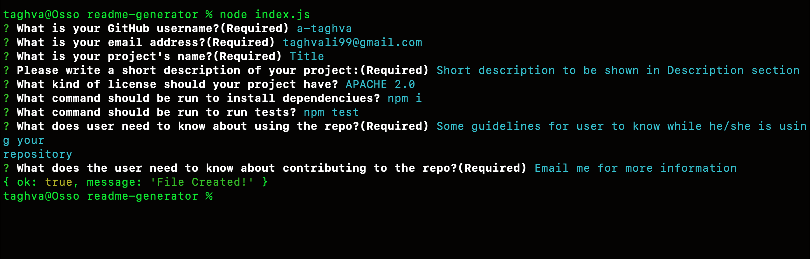

# README Generator

## Table of Contents
* [Description](#description)
* [Installation](#installation)
* [License](#license)
* [Demo](#demo)
* [Contribution](#contribution)

## Description
This app will generate a professional README file based on user's input

## Installation
The user should install node prior to use the application.  
And also download required modules.(inquirer)

## License
This project is licensed under the MIT license.

## Demo
[Demo of application](https://www.youtube.com/watch?v=F9q4qv-rn_Y)
 
 
This application was built with: JavaScript/Node

### Screenshot of application interface:
---

## Contribution
Made by Ali Taghva
